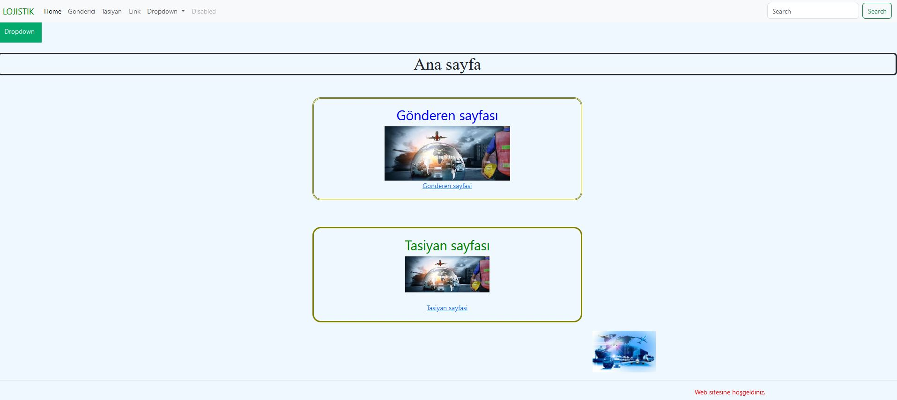
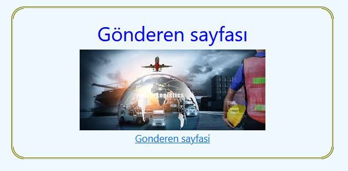
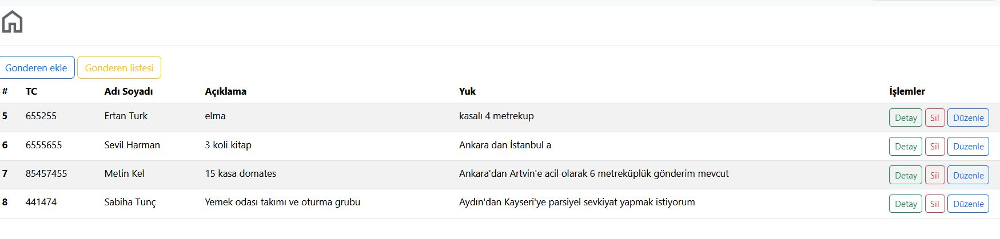
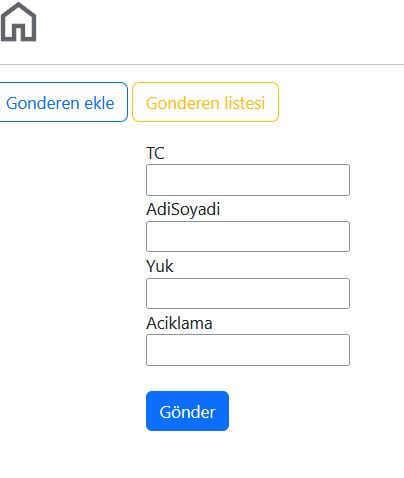
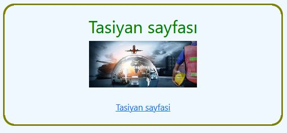
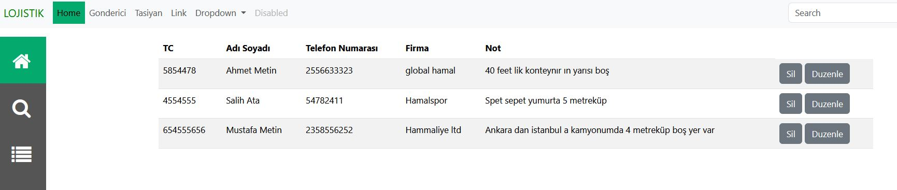
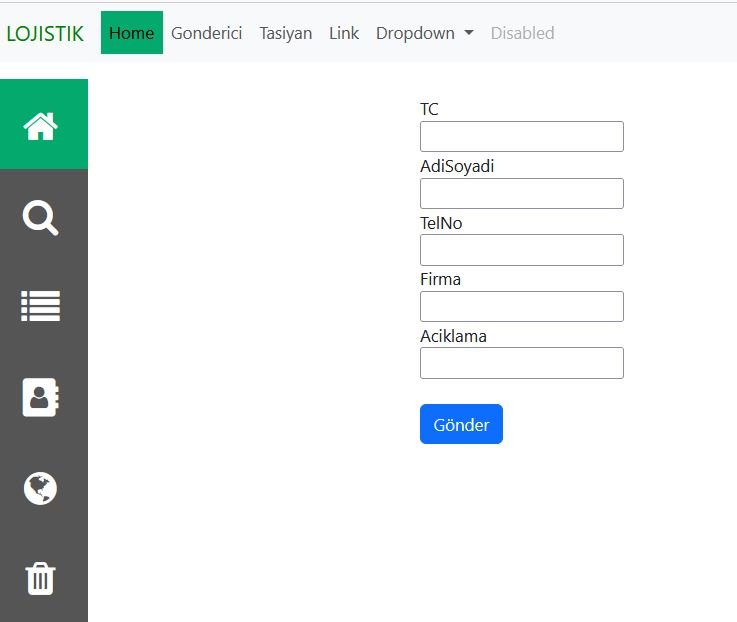

SİTE TANITIMI

LOJİSTİK web sitesi, yük taşıyan tır ve kamyon sahipleri ile yükünü sevk etmek isteyen yük sahibi arasındaki iletişimi başlatan sitedir.

ANA SAYFA GÖRÜNTÜSÜ

Ana sayfada bulunan "Gönderen Sayfası" ve "Tasiyan Sayfası" ndan birini seçerek istenen verileri girebilirsiniz.

Gönderen Sayfasını seçtiğimizde yük göndermek isteyen kişilerin bilgilerini  içeren liste ekrana gelmektedir. Aşağıda örnek bir görseli mevcuttur.

Bu sayfadan yeni yük sahibi bilgileri girilebilir, girilmiş olan bilgi düzenlenebilir, silinebilir veya detaylar görüntülenebilir.

Yeni bir gönderici kaydı eklenmesini sağlayan tablo görüntüsüdür.

Her yeni veri girişinden sonra ana tablo listesine veriler eklenmiş olur.

Tasiyan Sayfasını seçtiğimizde yük tasımak isteyen nakliyecilerin bilgilerini  içeren liste ekrana gelmektedir. Aşağıda örnek bir görseli mevcuttur.

Bu sayfadan yeni nakliyeci bilgileri girilebilir, girilmiş olan bilgi düzenlenebilir, silinebilir veya detaylar görüntülenebilir.

Yeni bir nakliyeci kaydı eklenmesini sağlayan tablo görüntüsüdür. Sol tarafta bulunan kişi ikonuna basılarak yukarıdaki yeni kayıt ekranı getirilir.

Her yeni veri girişinden sonra ana tablo listesine veriler eklenmiş olur.